# 🛒 Sport E-Commerce

##  สารบัญ
1. [Members](#1-members)
2. [หลักการและเหตุผล (Rationale)](#2-หลักการและเหตุผล-rationale)
3. [วัตถุประสงค์ของโครงงาน (Objectives)](#3-วัตถุประสงค์ของโครงงาน-objectives)
4. [ขอบเขตของระบบ (System Scope)](#4-ขอบเขตของระบบ-system-scope)
5. [แนวทางของการพัฒนาตาม SDLC (System Development Life Cycle)](#5-แนวทางของการพัฒนาตาม-sdlc-system-development-life-cycle)
6. [Tech Stack](#6-tech-stack)
7. [แนวทางการทดสอบ (Testing Approach)](#7-แนวทางการทดสอบ-testing-approach)
8. [ผลลัพธ์ที่คาดว่าจะได้รับ (Expected Outcomes)](#8-ผลลัพธ์ที่คาดว่าจะได้รับ-expected-outcomes)
9. [แผนการดำเนินงาน 4 สัปดาห์ (Work Plan: 4 Weeks)](#9-แผนการดำเนินงาน-4-สัปดาห์-work-plan-4-weeks)
10. [Requirement](#11-requirement)
11. [User Personas](#12-user-personas)
12. [Use Case Diagram](#13-use-case-diagram)
13. [Class Diagram](#14-class-diagram)
14. [Sequence Diagrams](#15-sequence-diagrams)
15. [Wireframe](#16-wireframe)
16. [System Architecture](#17-system-architecture)
17. [Data schema](#18-data-schema)

---

## 1. Members
| รหัสนักศึกษา | ชื่อ-นามสกุล | หน้าที่รับผิดชอบ |
| :--- | :--- | :--- |
| 67116507 | นายณภัทร นวหัสตินกุล | Frontend |
| 67112209 | น.ส.มุกอัญญมณี แก้วลาดวงษ์ | Backend |
| 67148270 | นายปรเมษฐ์ ลีลาวนาวัลย์ | Frontend |
| 67158250 | นายณวรุตม์ อินมีศรี | Frontend |
| 67105471 | นายวรศักดิ์ นิลห้อย | Backend |

## 2. หลักการและเหตุผล (Rationale)
ในปัจจุบันการดูแลสุขภาพและการเล่นกีฬาได้รับความนิยมเพิ่มมากขึ้น ส่งผลให้ความต้องการอุปกรณ์กีฬาที่ได้มาตรฐานมีอัตราการเติบโตที่สูงขึ้นตามไปด้วย อย่างไรก็ตาม การเลือกซื้อสินค้าผ่านหน้าร้านแบบดั้งเดิมมักมีข้อจำกัดในเรื่องของเวลาเปิด-ปิดร้าน รวมถึงความไม่สะดวกในการเดินทางของลูกค้า ในขณะเดียวกัน ฝั่งผู้ประกอบการหรือเจ้าของร้านเองก็ต้องเผชิญกับความยุ่งยากในการจัดการระบบหลังบ้าน โดยเฉพาะการจัดการสต๊อกสินค้าที่มักมีความคลาดเคลื่อน และการจดบันทึกออเดอร์แบบแมนนวลที่ทำให้เสียเวลา

ด้วยเหตุนี้ โครงงานนี้จึงถูกพัฒนาขึ้นเพื่อเป็นแพลตฟอร์มอีคอมเมิร์ซที่เข้ามาตอบโจทย์ทั้งสองฝ่าย โดยอำนวยความสะดวกให้ลูกค้าสามารถเลือกดูและสั่งซื้อสินค้าออนไลน์ได้ตลอด 24 ชั่วโมง และมุ่งเน้นการแก้ไขปัญหาให้ฝั่งร้านค้าด้วยระบบจัดการหลังบ้านที่ใช้งานง่าย มีระบบตัดสต๊อกอัตโนมัติแบบเรียลไทม์ทันทีที่มีการสั่งซื้อ ช่วยลดความผิดพลาดจากการทำงานของคน ทำให้ร้านค้าสามารถบริหารจัดการคลังสินค้า อัปเดตข้อมูล และรับออเดอร์ได้อย่างสะดวกสบายและมีประสิทธิภาพสูงสุด

## 3. วัตถุประสงค์ของโครงงาน (Objectives)
- เพื่อออกแบบระบบการซื้อสินค้าออนไลน์ให้ใช้งานง่าย สะดวกแก่ผู้ใช้งาน สามารถใช้งานเว็บได้ 24 ชั่วโมง
- เพื่อพัฒนาระบบหลังบ้านที่ช่วยแบ่งเบาภาระร้านค้า สร้างระบบการจัดการข้อมูลสินค้าที่ใช้งานง่าย ช่วยให้ร้านสามารถตรวจสอบ รวมถึงจัดการเพิ่มแก้ไขลบสินค้าในสต็อกได้อย่างง่ายดาย แม่นยำ
- เพื่อลดความผิดพลาดและประหยัดเวลาการทำงาน ทำให้ร้านค้าสามารถติดตามสถานะออเดอร์และยอดขายได้ตลอด 24 ชั่วโมง โดยไม่ต้องเสียเวลานับสต๊อกหลังร้านด้วยตัวเอง

## 4. ขอบเขตของระบบ (System Scope)
ระบบได้ถูกออกแบบโดยแบ่งขอบเขตการทำงานออกเป็น 3 ส่วนหลัก ตามสิทธิ์ของผู้ใช้งาน ดังนี้:

### 4.1 ระบบสำหรับลูกค้า (Customer) 
* **ค้นหาและกรองสินค้า:** สามารถดู ค้นหา และกรองสินค้าตามที่ต้องการได้
* **การสั่งซื้อสินค้า:** สามารถเลือกดูรายละเอียดอุปกรณ์กีฬา และทำรายการสั่งซื้อสินค้าผ่านระบบออนไลน์ได้
* **การติดตามสถานะ:** สามารถตรวจสอบและติดตามสถานะคำสั่งซื้อของตนเองได้

### 4.2 ระบบสำหรับพนักงาน (Staff)
* **แดชบอร์ดพนักงาน :** สามารถตรวจสอบสินค้าที่ใกล้จะหมด/ ออเดอร์ที่เข้ามาใหม่/ ออเดอร์ที่ไม่ได้รับการอัพเดตนานเกิน3วัน เพื่อป้องกันการตกหล่น
* **จัดการคำสั่งซื้อ :** สามารถดูรายการสั่งซื้อใหม่ และดูรายละเอียดของสินค้าที่ลูกค้าทำรายการเข้ามาได้
* **อัปเดตสถานะการจัดส่ง:** สามารถปรับเปลี่ยนสถานะของคำสั่งซื้อเพื่อแจ้งเตือนลูกค้า (เช่น จาก "รอจัดส่ง" -> "กำลังจัดส่ง" -> "จัดส่งสำเร็จ")

### 4.3 ระบบสำหรับผู้จัดการ  (Manager)
* **แดชบอร์ดภาพรวมธุรกิจ (Sales Dashboard):** แสดงกราฟหรือตัวเลขสรุปยอดขายแบบรายวันและรายสัปดาห์ รวมถึงรายการ "สินค้าขายดี" และระบบแจ้งเตือน "สินค้าที่สต็อกใกล้จะหมด" (Low Stock Alert)
* **จัดการคลังสินค้าเต็มรูปแบบ (Product Management):** สามารถ เพิ่ม ลบ หรือแก้ไขข้อมูลอุปกรณ์กีฬา (เช่น เปลี่ยนชื่อสินค้า, ปรับราคา, อัปโหลดรูปภาพสินค้าใหม่) และอัปเดตตัวเลขจำนวนสต็อกเข้าคลังสินค้าได้โดยตรง
* **จัดการผู้ใช้งาน (User Management):** สามารถจัดการสิทธิ์พนักงาน (สร้างบัญชีใหม่, ลบ, หรือระงับบัญชี) และสามารถดูรายชื่อลูกค้าพร้อมตรวจสอบประวัติการสั่งซื้อย้อนหลังของลูกค้าแต่ละรายได้


## 5. แนวทางของการพัฒนาตาม SDLC (System Development Life Cycle)
* **Phase 1: Planning (การวางแผน):** กำหนดขอบเขตของระบบ, จัดทำแผนการดำเนินงาน, วางโครงสร้าง GitHub Repository, กำหนด System Architecture, และแบ่งหน้าที่ความรับผิดชอบภายในทีมอย่างชัดเจน
* **Phase 2: Analysis (การวิเคราะห์):** รวบรวมและวิเคราะห์ Requirement ของทั้งฝั่งลูกค้าและผู้ดูแลระบบ, จัดทำ User Personas, และใช้ Use Case Diagram ในการวิเคราะห์พฤติกรรมและสิ่งที่ระบบต้องทำได้
* **Phase 3: Design (การออกแบบ):** ออกแบบ Wireframe และ UI/UX สำหรับ Frontend , เขียน ER Diagram เพื่อออกแบบและกำหนดความสัมพันธ์ (Relation) ของฐานข้อมูล, รวมไปถึงการทำ API Specification
* **Phase 4: Development (การพัฒนาระบบ):** ลงมือเขียนโค้ดตามที่ออกแบบไว้ โดยพัฒนา Backend ด้วย Node.js, พัฒนา Frontend ด้วย React เชื่อมเข้าดก้วยกัน
* **Phase 5: Testing (การทดสอบ):** ทดสอบการเรียก API, ตรวจสอบการทำงานของปุ่มและฟอร์มบนหน้าเว็บจริง, และการจำลองเป็นผู้ใช้งานเพื่อเดินตามโฟลว์ตั้งแต่ต้นจนจบ (UAT) เพื่อตรวจสอบตรรกะและหาข้อผิดพลาด
* **Phase 6: Deployment (การติดตั้งระบบ):** นำระบบที่ผ่านการทดสอบสมบูรณ์แล้วไปอัปโหลดและติดตั้งบน Cloud 
* **Phase 7: Maintenance (การบำรุงรักษา):** รวบรวม Feedback จากผู้ใช้งานจริงเพื่อนำมาวิเคราะห์ แก้ไขบั๊ก ปรับปรุงจุดที่ใช้งานไม่สะดวก


## 6. Tech Stack
- **Frontend:** React
- **Backend:** Node.js, 
- **Database:** JSON File Storage, LocalStorage

## 7. แนวทางการทดสอบ (Testing Approach)
* **Functional Testing :** ตรวจสอบความถูกต้องของการทำงานแต่ละส่วนบนหน้าเว็บไซต์ เช่น ความถูกต้องของระบบตะกร้าสินค้า, การคำนวณราคารวม, การแสดงผลต่างๆ
* **UAT :** จำลองสถานการณ์การใช้งานจริงตั้งแต่ขั้นตอนแรกจนจบกระบวนการ ในทุก role
* **ตรวจสอบฐานข้อมูล :** ตรวจสอบการทำงานร่วมกันระหว่างระบบหน้าบ้านและหลังบ้าน เพื่อยืนยันว่าเมื่อมีการทำรายการใดๆ เกิดขึ้น ข้อมูลในฐานข้อมูล เช่น จำนวนสต๊อกสินค้าและสถานะคำสั่งซื้อ จะได้รับการอัปเดตอย่างถูกต้องและตรงกันแบบเรียลไทม์


## 8. ผลลัพธ์ที่คาดว่าจะได้รับ (Expected Outcomes)
- ผู้ใช้สามารถใช้งานเว็บได้ แสดงผล ทำงานได้ถูกต้องและมีประสิทธิภาพ ตามroleของผู้ใช้
- พนักงานสามารถตรวจสอบสต็อก ออเดอร์ และสามารถจัดการสถานะของออเดอร์ได้
- เมเนเจอร์สามารถบริหารจัดการธุรกิจได้อย่างมีประสิทธิภาพ ทั้งการจัดการสต็อกสินค้า โดยสามารถตรวจสอบ เพิ่ม ลบ แก้ไขสินค้าในสต็อก และสามารถตรวจสอบออเดอร์ และอัพเดตสถานะ
- ระบบที่มีการอัพเดตข้อมูลในdbได้ทันที หลังจากมีการเปลี่ยนแปลง เพื่อลดความผิดพลาด
- เมเนเจอร์สามารถกำหนด roleของผู้ใช้ได้ และสามารถระงับการใช้งานของuserได้

## 9. แผนการดำเนินงาน 4 สัปดาห์ (Work Plan: 4 Weeks)
- **สัปดาห์ที่ 1:** วิเคราะห์ requirement,แบ่งหน้าที่, ทำdiagramต่างๆเช่นuse case, class, er diagram, ออกแบบschema, set up project, เขียน wireframe
- **สัปดาห์ที่ 2:** พัฒนาระบบหน้าบ้านสำหรับผู้ใช้งานทั่วไป เช่นหน้าแสดงรายการสินค้า ระบบตะกร้าสินค้า และหน้าแดชบอร์ดสำหรับพนักงานและผู้จัดการ เพื่อให้แสดงผลข้อมูลได้ถูกต้องตามrole ของผู้ใช้งาน
- **สัปดาห์ที่ 3:** เชื่อมหน้าบ้านและหลังบ้านอ โดยใช้database แบบ file based storage (json)
- **สัปดาห์ที่ 4:** ทดสอบความถูกต้องของระบบและจำลองการใช้งานจริง

## 10. Requirement
### 10.1 Functional Requirement
* **ระบบลูกค้า (Customer):**
  * ระบบต้องอนุญาตให้ผู้ใช้สมัครสมาชิก ล็อกอิน และจัดการข้อมูลส่วนตัวได้
  * ระบบต้องสามารถค้นหา กรองหมวดหมู่ และดูรายละเอียดของอุปกรณ์กีฬาได้
  * ระบบต้องมีฟังก์ชันตะกร้าสินค้า (เพิ่ม/ลด/ลบ สินค้า) และคำนวณราคาสุทธิได้
  * ระบบต้องรองรับการสั่งซื้อ และการติดตามสถานะออเดอร์
* **ระบบพนักงาน (Staff):**
  * ระบบต้องแสดงรายการคำสั่งซื้อใหม่ และรายละเอียดสินค้าที่ลูกค้าสั่งได้
  * ระบบต้องอนุญาตให้พนักงานอัปเดตสถานะคำสั่งซื้อ (เช่น รอตรวจสอบ, กำลังจัดส่ง) ได้
* **ระบบผู้จัดการ (Manager / Admin):**
  * ระบบต้องมีหน้า Dashboard แสดงกราฟยอดขายรายวัน/สัปดาห์ และสินค้ายอดฮิต
  * ระบบต้องมีฟังก์ชันการจัดการสินค้า (เพิ่ม/ลบ/แก้ไขข้อมูล และอัปโหลดรูปภาพ)
  * ระบบต้องมีฟังก์ชันจัดการบัญชีผู้ใช้งาน (เพิ่มพนักงาน, ระงับบัญชี, ดูประวัติลูกค้า)

### 10.2 Non-Functional Requirement
* **Usability** หน้าเว็บต้องรองรับการแสดงผลทุกขนาดหน้าจอ (Responsive Design) และมีการออกแบบ UI/UX สไตล์ Soft UI เน้นความเรียบง่าย สบายตา เพื่อให้ผู้ใช้รู้สึกเป็นมิตรและใช้งานง่าย
* **Performance** หน้าเว็บควรตอบสนองและโหลดข้อมูลรูปภาพสินค้าเสร็จสิ้นภายใน 3 วินาที (ภายใต้ความเร็วอินเทอร์เน็ตปกติ)
* **Security** รหัสผ่านของผู้ใช้งานทั้งหมดต้องถูกเข้ารหัสก่อนบันทึกลงฐานข้อมูล และ API ต้องมีการตรวจสอบสิทธิ์ก่อนการดึงข้อมูลสำคัญ
* **Reliability** ระบบต้องทำงานได้อย่างเสถียร สามารถรองรับผู้ใช้งานพร้อมกันได้

### 10.3 Domain Requirement
* **Inventory Rule (กฎการจัดการสต๊อก):** ลูกค้าจะไม่สามารถสั่งซื้อสินค้าที่มีจำนวนเกินกว่าสต๊อกที่เหลืออยู่ในคลังได้
* **Real-time Deduction (การตัดสต๊อกอัตโนมัติ):** เมื่อการสั่งซื้อได้รับการยืนยัน ระบบจะต้องตัดยอดสต๊อกสินค้าคงเหลือในคลัง ทันทีเพื่อป้องกันการขายสินค้าซ้ำซ้อน
* **Order Workflow (สถานะคำสั่งซื้อ):** ออเดอร์ต้องดำเนินตามลำดับขั้นตอนที่ธุรกิจกำหนดไว้เท่านั้น (เช่น "รอชำระเงิน"-> "กำลังเตรียมจัดส่ง" -> "กำลังจัดส่ง" -> "จัดส่งสำเร็จ")
* **Low Stock Alert (การแจ้งเตือนสต๊อกต่ำ):** ระบบต้องแจ้งเตือนแอดมินทันทีเมื่อมีอุปกรณ์กีฬาชิ้นใดในคลังเหลือจำนวนน้อยกว่าเกณฑ์ที่กำหนด (เช่น เหลือน้อยกว่า 5 ชิ้น)

## 11. User Personas
### 👤 1. Customer (ลูกค้าผู้รักสุขภาพและอุปกรณ์กีฬา)
**ชื่อ:** คุณธนัท (อายุ 28 ปี)
**อาชีพ:** พนักงานออฟฟิศ (Office Worker)
* **พฤติกรรม (Behavior):** ชื่นชอบการเล่นกีฬาและออกกำลังกายหลังเลิกงาน มักจะหาข้อมูลสเปกอุปกรณ์กีฬาผ่านอินเทอร์เน็ตก่อนตัดสินใจซื้อเสมอ
* **เป้าหมาย (Goals):** ต้องการซื้อรองเท้าวิ่งและอุปกรณ์ฟิตเนสใหม่ แต่ต้องการความสะดวกรวดเร็ว สามารถกดสั่งซื้อและเช็คสถานะการส่งของได้ตลอดเวลาโดยไม่ต้องทักแชทถามแอดมิน
* **ปัญหาที่พบ (Pain Points):** 
  * ไม่มีเวลาไปเดินเลือกซื้อที่หน้าร้านเพราะเลิกงานดึก (ร้านปิดแล้ว)
  * เคยหงุดหงิดกับการสั่งของร้านอื่นแล้วโอนเงินไปแล้ว แต่เพิ่งมาทราบทีหลังว่า "ของหมดสต๊อก" 
  * อยากได้หน้าเว็บที่ดูสะอาดตา ใช้งานง่าย ไม่ซับซ้อน

### 🧑‍💻 2. Staff (พนักงานจัดการออเดอร์)
**ชื่อ:** น้องเมย์ (อายุ 24 ปี)
**อาชีพ:** พนักงานฝ่ายปฏิบัติการร้านค้า (Store Operations Staff)
* **พฤติกรรม (Behavior):** รับหน้าที่ดูแลออเดอร์รายวัน จัดเตรียมสินค้าเพื่อจัดส่ง และต้องคอยตอบคำถามลูกค้าว่า "ของส่งหรือยัง?"
* **เป้าหมาย (Goals):** ต้องการระบบหลังบ้านที่ดูรายการคำสั่งซื้อใหม่ได้ง่ายๆ และกดอัปเดตสถานะการจัดส่ง (เช่น กำลังเตรียมจัดส่ง) ได้อย่างรวดเร็ว
* **ปัญหาที่พบ (Pain Points):** 
  * ระบบจดมือหรือใช้ Excel แบบเก่าทำให้เกิดข้อผิดพลาดบ่อย (ออเดอร์ตกหล่น)
  * การเดินไปเช็คสต๊อกหลังร้านทุกครั้งที่มีคนสั่งซื้อทำให้เสียเวลาทำงานมาก

### 👔 3. Manager (เจ้าของธุรกิจ/ผู้จัดการร้าน)
**ชื่อ:** คุณสมเกียรติ (อายุ 45 ปี)
**อาชีพ:** เจ้าของร้านจำหน่ายอุปกรณ์กีฬา (Business Owner)
* **พฤติกรรม (Behavior):** ไม่ค่อยได้ลงมาดูแลการแพ็คของเอง แต่เน้นการบริหารภาพรวม ดูยอดขาย และวางแผนสั่งซื้อสินค้าเข้ามาเติมในโกดัง
* **เป้าหมาย (Goals):** ต้องการเห็นภาพรวมของธุรกิจผ่าน Dashboard ว่าวัน/สัปดาห์นี้ขายได้เท่าไหร่ สินค้าไหนขายดี และสามารถจัดการเพิ่ม/ลด/แก้ไขข้อมูลสินค้าในร้านได้ด้วยตัวเอง
* **ปัญหาที่พบ (Pain Points):** 
  * ไม่รู้ตัวเลขสต๊อกที่แท้จริง ทำให้บางครั้งสั่งของมาดองไว้เยอะเกินไป หรือบางทีของขายดีก็ขาดสต๊อกโดยไม่รู้ตัว (ต้องการระบบแจ้งเตือน Low Stock)
  * ต้องการควบคุมสิทธิ์พนักงาน เพื่อความปลอดภัยของข้อมูลลูกค้าและบัญชีของร้าน

  
## 12. Use Case Diagram
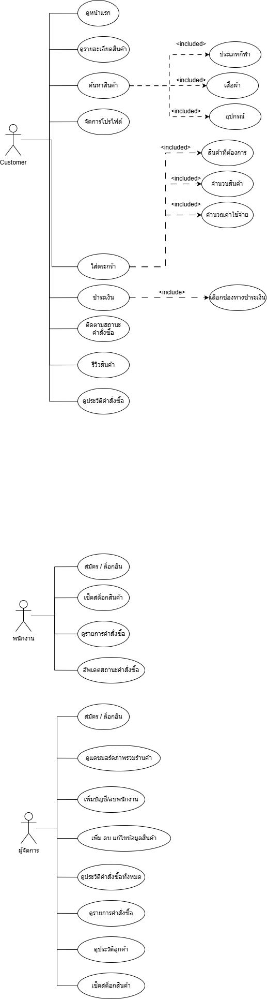

## 13. Class Diagram
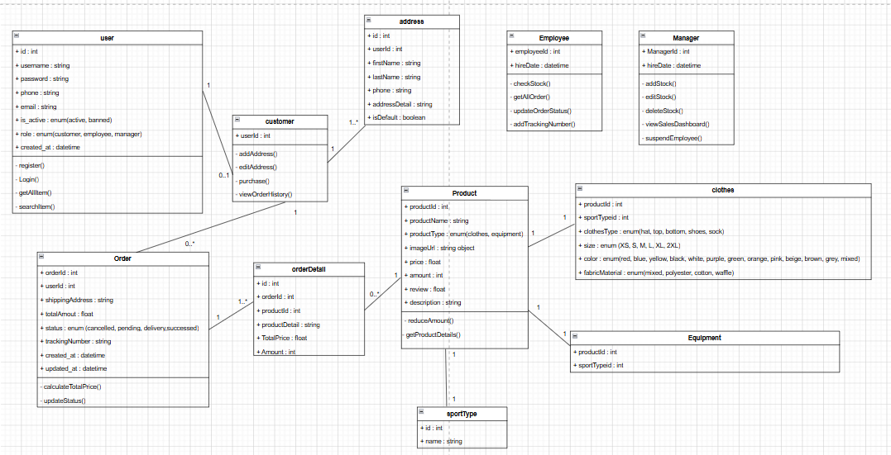

## 14. Sequence Diagrams
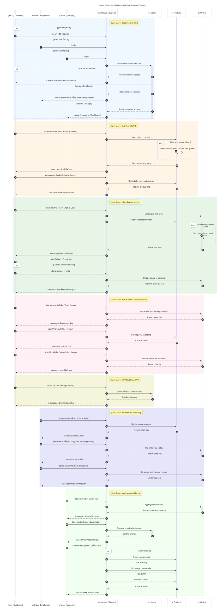

## 15. Wireframe
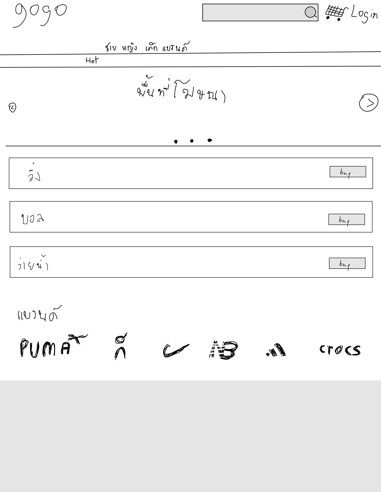
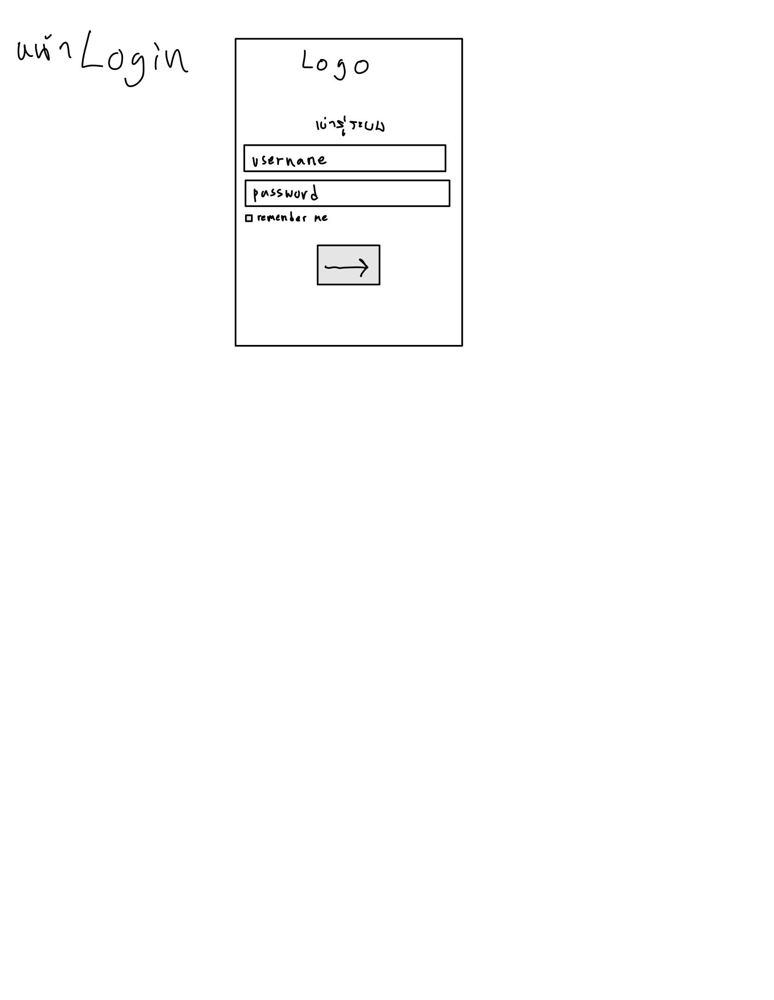
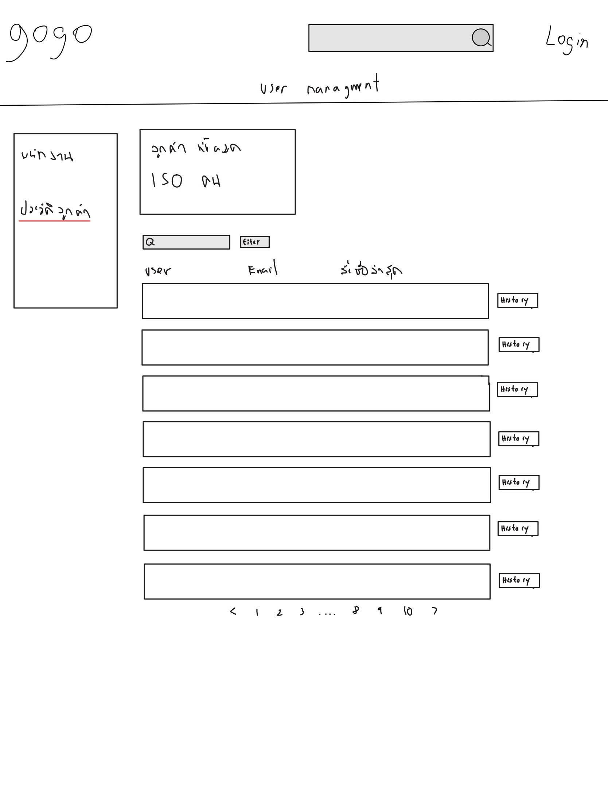
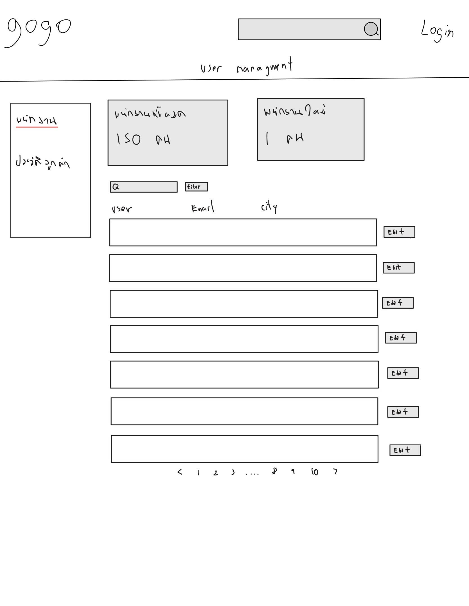
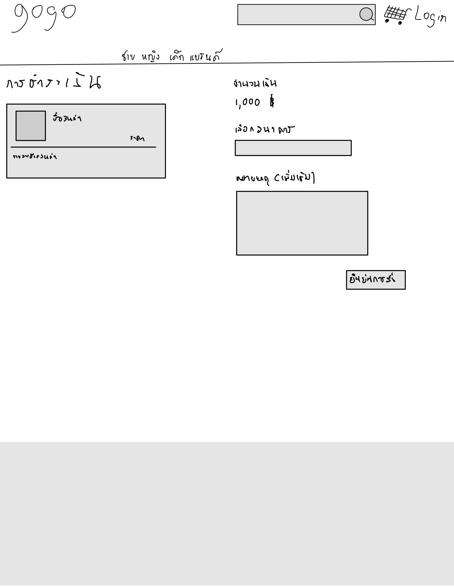
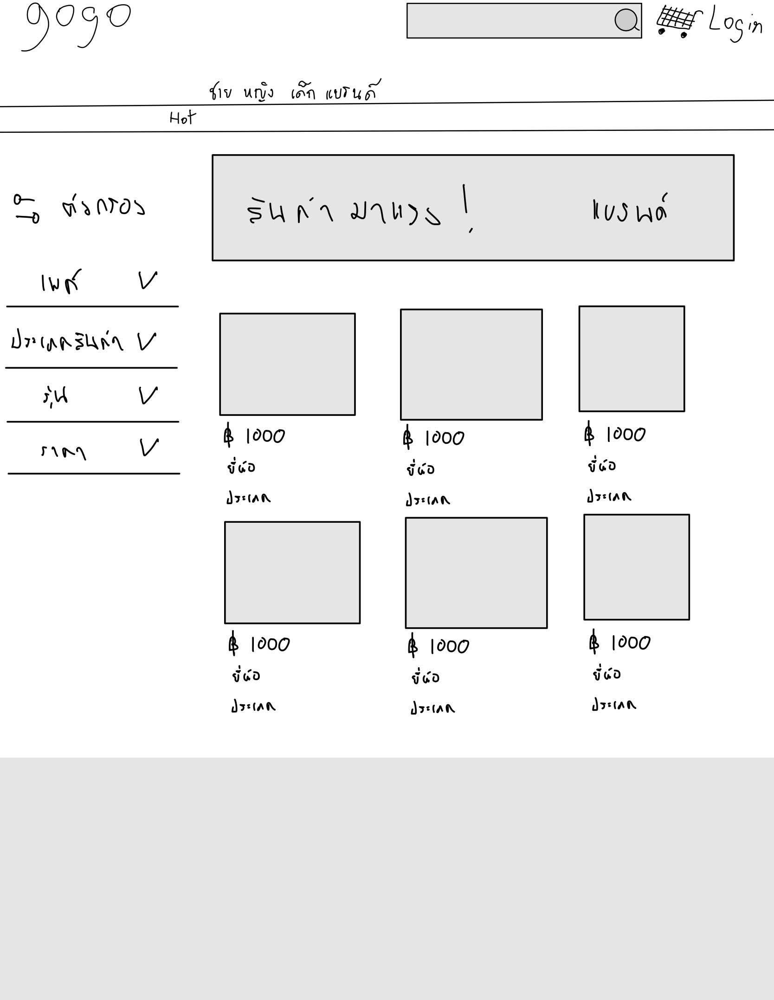
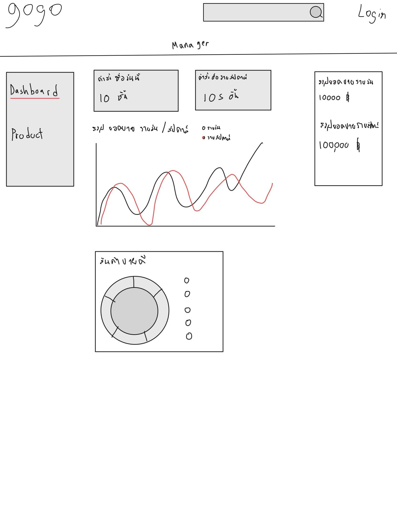
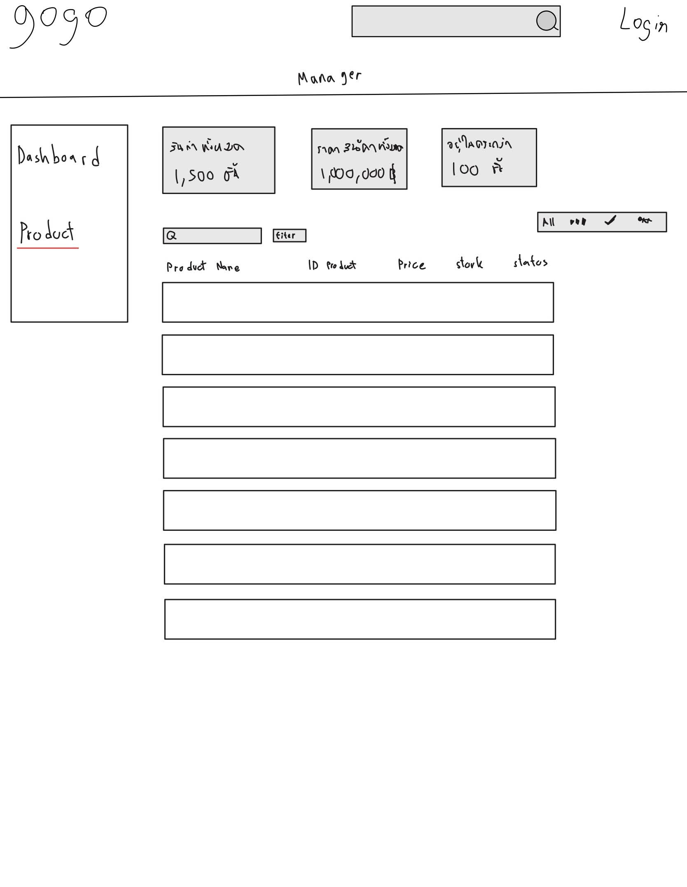
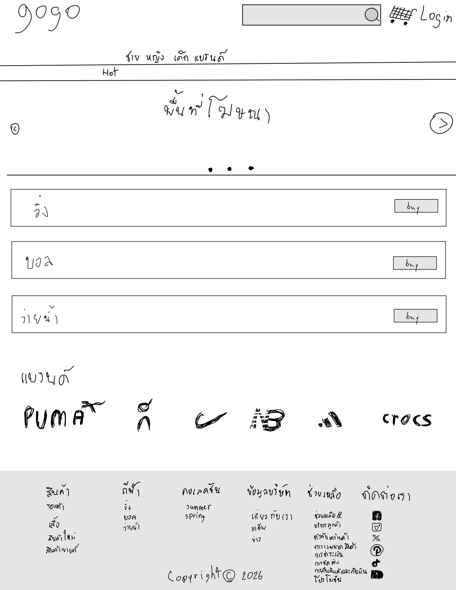
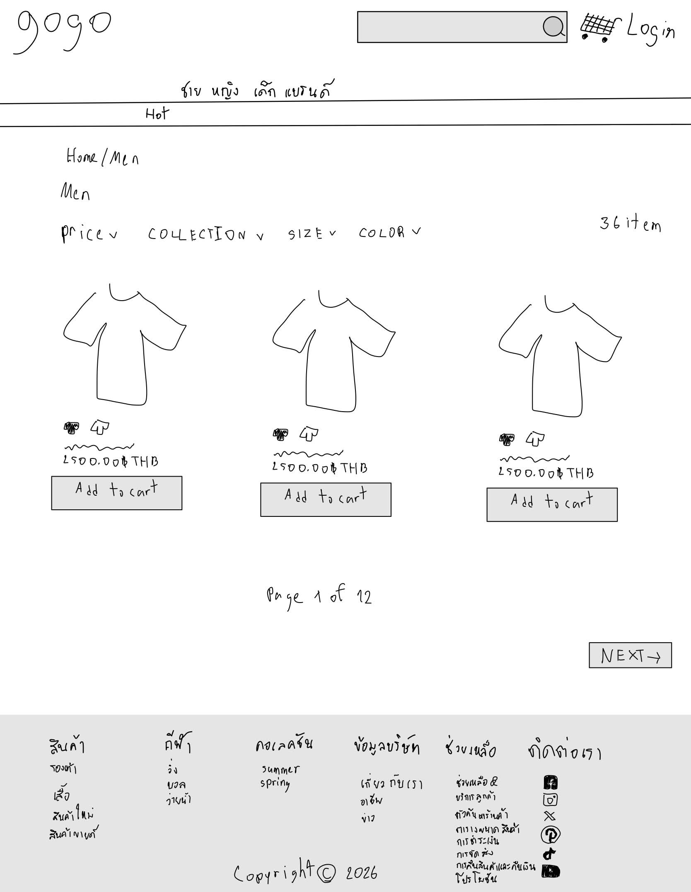

## 16. System Architecture

สถาปัตยกรรมของระบบ (System Architecture) ถูกออกแบบในรูปแบบ **Client-Server Architecture** แบ่งออกเป็น 2 ชั้นหลัก ได้แก่ **Frontend** (React + Vite) และ **Backend** (Node.js + Express) โดยใช้ **JSON File-based Storage** เป็นฐานข้อมูล

---

### 16.1 ภาพรวม System Architecture

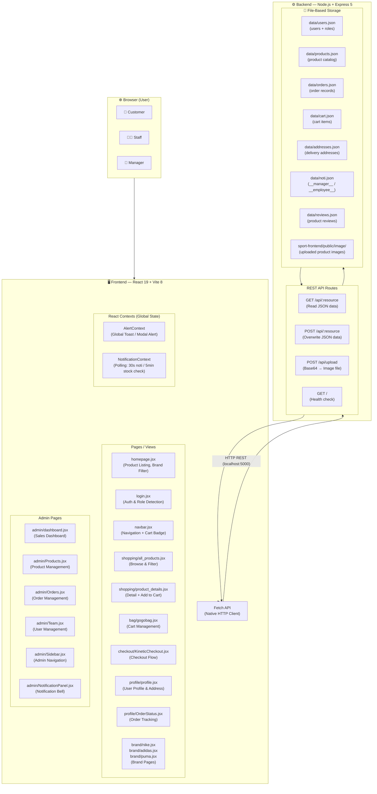
```mermaid
flowchart TB
    subgraph Browser ["🌐 Browser (User)"]
        direction LR
        Customer["👤 Customer"]
        Staff["🧑‍💻 Staff"]
        Manager["👔 Manager"]
    end

    subgraph Frontend ["🖥️ Frontend — React 19 + Vite 8"]
        direction TB

        subgraph Pages ["Pages / Views"]
            PG1["homepage.jsx\n(Product Listing, Brand Filter)"]
            PG2["login.jsx\n(Auth & Role Detection)"]
            PG3["navbar.jsx\n(Navigation + Cart Badge)"]
            PG4["shopping/all_products.jsx\n(Browse & Filter)"]
            PG5["shopping/product_details.jsx\n(Detail + Add to Cart)"]
            PG6["bag/gogobag.jsx\n(Cart Management)"]
            PG7["checkout/KineticCheckout.jsx\n(Checkout Flow)"]
            PG8["profile/profile.jsx\n(User Profile & Address)"]
            PG9["profile/OrderStatus.jsx\n(Order Tracking)"]
            PG10["brand/nike.jsx\nbrand/adidas.jsx\nbrand/puma.jsx\n(Brand Pages)"]
        end

        subgraph AdminPages ["Admin Pages"]
            ADM1["admin/dashboard.jsx\n(Sales Dashboard)"]
            ADM2["admin/Products.jsx\n(Product Management)"]
            ADM3["admin/Orders.jsx\n(Order Management)"]
            ADM4["admin/Team.jsx\n(User Management)"]
            ADM5["admin/Sidebar.jsx\n(Admin Navigation)"]
            ADM6["admin/NotificationPanel.jsx\n(Notification Bell)"]
        end

        subgraph Contexts ["React Contexts (Global State)"]
            CTX1["AlertContext\n(Global Toast / Modal Alert)"]
            CTX2["NotificationContext\n(Polling: 30s noti / 5min stock check)"]
        end

        FetchAPI["Fetch API\n(Native HTTP Client)"]
    end

    subgraph Backend ["⚙️ Backend — Node.js + Express 5"]
        direction TB

        subgraph API ["REST API Routes"]
            R1["GET /api/:resource\n(Read JSON data)"]
            R2["POST /api/:resource\n(Overwrite JSON data)"]
            R3["POST /api/upload\n(Base64 → Image file)"]
            R4["GET /\n(Health check)"]
        end

        subgraph FileSystem ["📁 File-Based Storage"]
            DB1["data/users.json\n(users + roles)"]
            DB2["data/products.json\n(product catalog)"]
            DB3["data/orders.json\n(order records)"]
            DB4["data/cart.json\n(cart items)"]
            DB5["data/addresses.json\n(delivery addresses)"]
            DB6["data/noti.json\n(__manager__ / __employee__)"]
            DB7["data/reviews.json\n(product reviews)"]
            IMG["sport-frontend/public/image/\n(uploaded product images)"]
        end
    end

    Browser --> Frontend
    Frontend --> FetchAPI
    FetchAPI -- "HTTP REST (localhost:5000)" --> API
    API --> FileSystem
    FileSystem --> API
    API --> FetchAPI
```

---

### 16.2 Frontend Architecture

| ส่วนประกอบ | เทคโนโลยี | รายละเอียด |
|---|---|---|
| **UI Framework** | React 19 | Component-based UI, Hooks |
| **Build Tool** | Vite 8 | Fast HMR, ESM bundling |
| **Styling** | TailwindCSS 3 | Utility-first CSS, Responsive Design |
| **Icons** | Lucide React | SVG icon set |
| **HTTP Client** | Fetch API (native) | ไม่ใช้ Axios — ใช้ `fetch()` ของ browser โดยตรง |
| **State Management** | React Context API | `AlertContext`, `NotificationContext` |
| **Routing** | State-based (no router) | การเปลี่ยนหน้าใช้ React state ภายใน `homepage.jsx` |

#### โครงสร้างโฟลเดอร์ Frontend

```
sport-frontend/src/
├── main.jsx                  ← Entry point (wraps AlertProvider)
├── App.jsx                   ← App root
├── homepage.jsx              ← Main page controller (state-based routing)
├── navbar.jsx                ← Top navigation + cart badge
├── login.jsx                 ← Login & Register form
├── index.css                 ← Global styles
│
├── shopping/
│   ├── all_products.jsx      ← Browse & filter all products
│   └── product_details.jsx  ← Product detail + Add to cart
│
├── bag/
│   └── gogobag.jsx          ← Shopping cart management
│
├── checkout/
│   └── KineticCheckout.jsx  ← Multi-step checkout flow
│
├── profile/
│   ├── profile.jsx          ← User profile & address book
│   └── OrderStatus.jsx      ← Order history & tracking
│
├── brand/
│   ├── nike.jsx             ← Nike brand page
│   ├── adidas.jsx           ← Adidas brand page
│   └── puma.jsx             ← Puma brand page
│
├── admin/
│   ├── dashboard.jsx        ← Sales dashboard (chart + low stock alert)
│   ├── Products.jsx         ← CRUD product management
│   ├── Orders.jsx           ← Order management + status update
│   ├── Team.jsx             ← User/staff management
│   ├── Sidebar.jsx          ← Admin sidebar navigation
│   └── NotificationPanel.jsx ← Notification bell panel
│
└── contexts/
    ├── AlertContext.jsx      ← Global modal alert (info/success/error/warning)
    └── NotificationContext.jsx ← Polling-based notification system
```

---

### 16.3 Backend Architecture

| ส่วนประกอบ | เทคโนโลยี | รายละเอียด |
|---|---|---|
| **Runtime** | Node.js (ES Module) | `"type": "module"` |
| **Framework** | Express 5 | RESTful API server |
| **Port** | 5000 | `http://localhost:5000` |
| **CORS** | cors package | อนุญาต cross-origin จาก frontend |
| **Storage** | JSON File System | อ่าน/เขียนไฟล์ `.json` โดยตรง (ไม่มี ORM/DB) |
| **Image Upload** | Base64 → Binary file | บันทึกรูปลง `sport-frontend/public/image/` |

#### API Endpoints

| Method | Endpoint | หน้าที่ |
|---|---|---|
| `GET` | `/api/products` | ดึงรายการสินค้าทั้งหมด |
| `POST` | `/api/products` | บันทึกข้อมูลสินค้า (overwrite) |
| `GET` | `/api/orders` | ดึงรายการออเดอร์ทั้งหมด |
| `POST` | `/api/orders` | บันทึกออเดอร์ (overwrite) |
| `GET` | `/api/users` | ดึงข้อมูลผู้ใช้ |
| `POST` | `/api/users` | บันทึกข้อมูลผู้ใช้ |
| `GET` | `/api/cart` | ดึงข้อมูลตะกร้า |
| `POST` | `/api/cart` | บันทึกข้อมูลตะกร้า |
| `GET` | `/api/addresses` | ดึงที่อยู่จัดส่ง |
| `POST` | `/api/addresses` | บันทึกที่อยู่จัดส่ง |
| `GET` | `/api/noti` | ดึงการแจ้งเตือน (manager/employee) |
| `POST` | `/api/noti` | บันทึกการแจ้งเตือน |
| `GET` | `/api/reviews` | ดึงรีวิวสินค้า |
| `POST` | `/api/reviews` | บันทึกรีวิวสินค้า |
| `POST` | `/api/upload` | อัปโหลดรูปสินค้า (Base64) |
| `GET` | `/` | Health check |

---

### 16.4 Data Flow Diagram

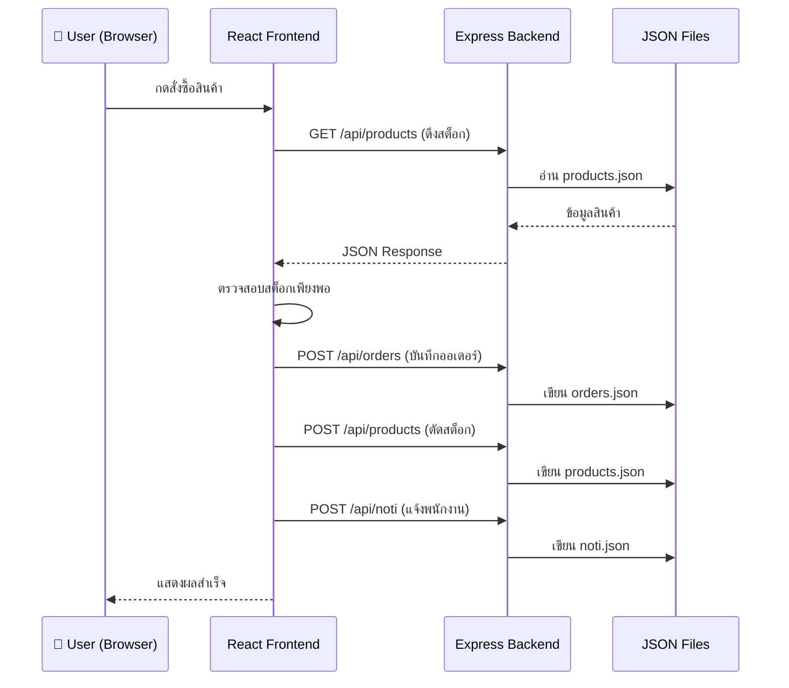
```mermaid
sequenceDiagram
    participant U as 👤 User (Browser)
    participant FE as React Frontend
    participant BE as Express Backend
    participant FS as JSON Files

    U->>FE: กดสั่งซื้อสินค้า
    FE->>BE: GET /api/products (ดึงสต็อก)
    BE->>FS: อ่าน products.json
    FS-->>BE: ข้อมูลสินค้า
    BE-->>FE: JSON Response
    FE->>FE: ตรวจสอบสต็อกเพียงพอ
    FE->>BE: POST /api/orders (บันทึกออเดอร์)
    BE->>FS: เขียน orders.json
    FE->>BE: POST /api/products (ตัดสต็อก)
    BE->>FS: เขียน products.json
    FE->>BE: POST /api/noti (แจ้งพนักงาน)
    BE->>FS: เขียน noti.json
    FE-->>U: แสดงผลสำเร็จ
```

---

### 16.5 Notification System

ระบบแจ้งเตือน (Notification) ทำงานแบบ **Polling** ผ่าน `NotificationContext`:

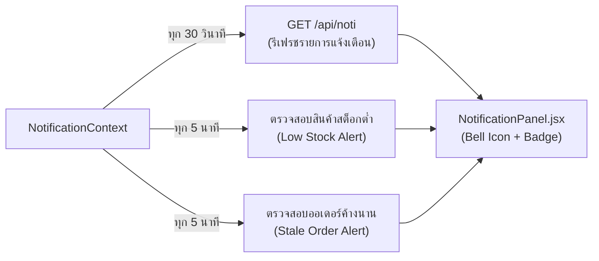
```mermaid
flowchart LR
    NC["NotificationContext"]
    NC -- "ทุก 30 วินาที" --> FetchNoti["GET /api/noti\n(รีเฟรชรายการแจ้งเตือน)"]
    NC -- "ทุก 5 นาที" --> CheckStock["ตรวจสอบสินค้าสต็อกต่ำ\n(Low Stock Alert)"]
    NC -- "ทุก 5 นาที" --> CheckOrders["ตรวจสอบออเดอร์ค้างนาน\n(Stale Order Alert)"]
    FetchNoti --> NotiPanel["NotificationPanel.jsx\n(Bell Icon + Badge)"]
    CheckStock --> NotiPanel
    CheckOrders --> NotiPanel
```

| การแจ้งเตือน | เงื่อนไข | ผู้รับ |
|---|---|---|
| **Low Stock Alert** | สินค้าเหลือน้อยกว่า threshold | Manager, Employee |
| **Stale Order Alert** | ออเดอร์ไม่ได้อัปเดตนาน > 3 วัน | Manager, Employee |
| **New Order** | มีคำสั่งซื้อใหม่เข้ามา | Employee |

---

### 16.6 User Role & Access Control

| Role | หน้าที่สามารถเข้าถึง |
|---|---|
| **Customer** | Homepage, Product Browse, Cart, Checkout, Profile, Order Status |
| **Employee (Staff)** | Admin Dashboard, Orders (update status), Notification |
| **Manager** | Admin Dashboard, Products (CRUD), Orders, Team Management, Notification |
## 17. Data schema
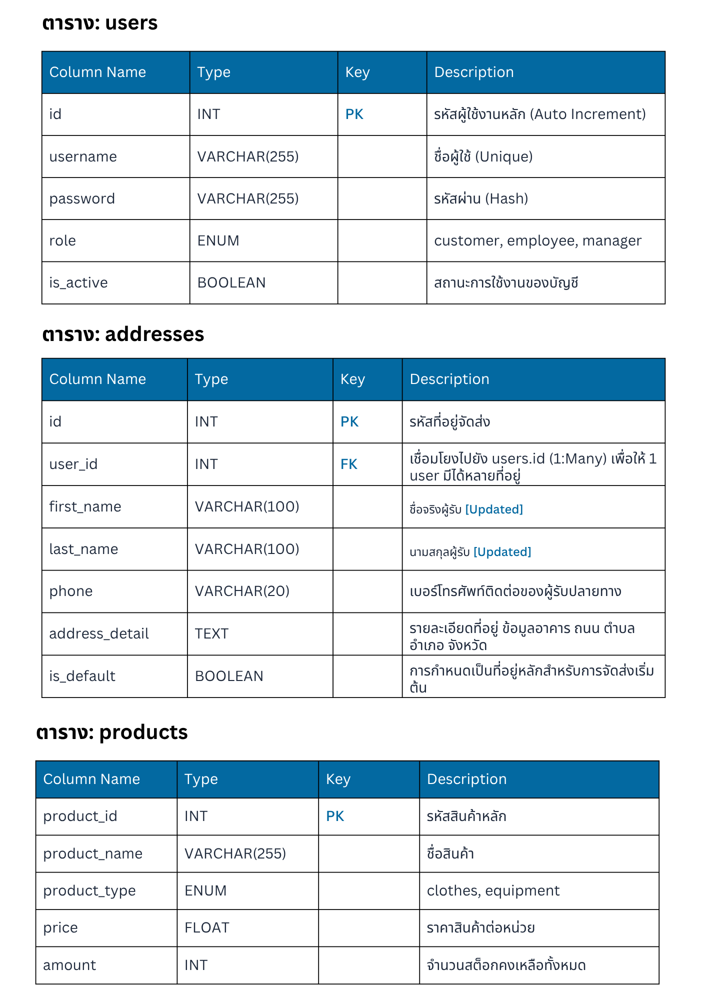
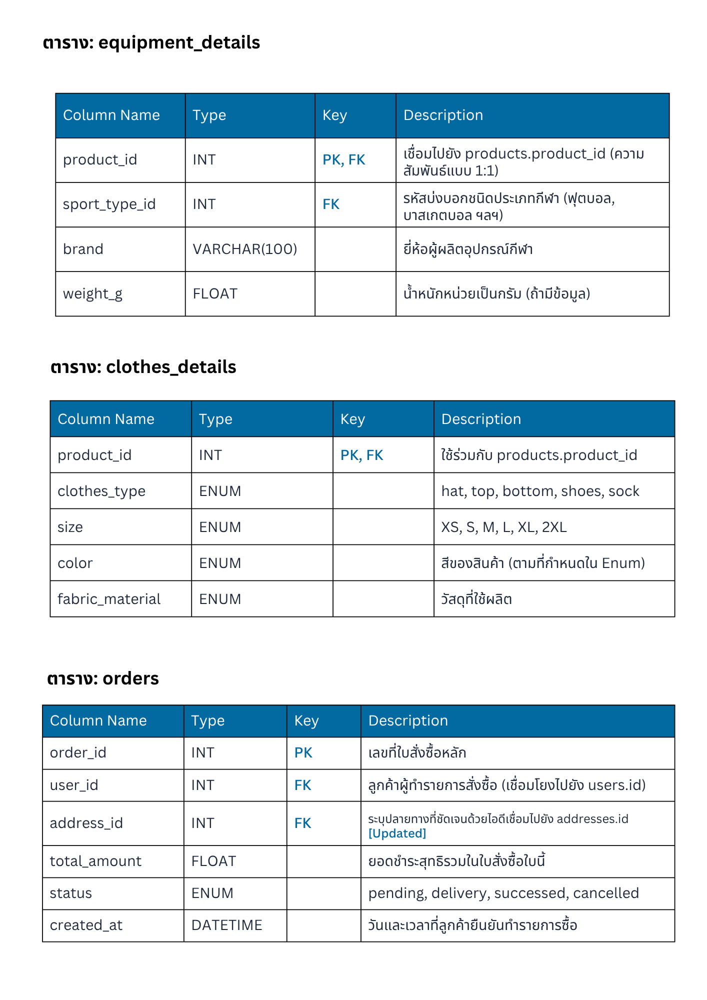
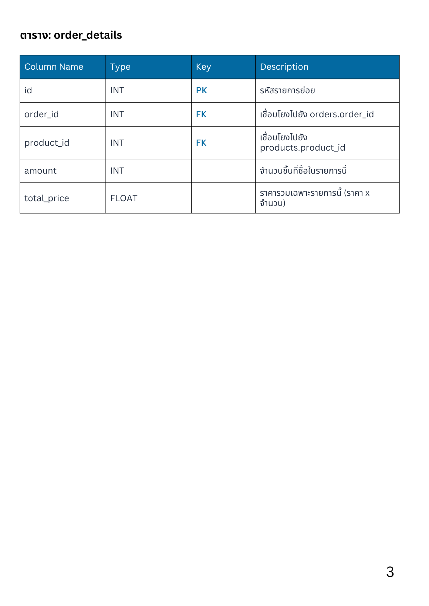
